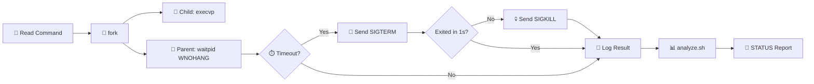

<div align="center">


<br/>


</div>

<br/>

A C based process runner with a Bash log analyzer, built for an Operating Systems course assignment. The runner reads shell commands from a file, executes each in a child process with a configurable timeout, and records the result. The analyzer parses the output log and produces a summary report. 🖥️

<div align="center">

</div>

---

## 👤 Student Info

<table>
<tr>
<td>🧑‍💻 <b>Student</b></td>
<td>Abdul Azeem</td>
</tr>
<tr>
<td>🆔 <b>ID</b></td>
<td>24i 2013</td>
</tr>
<tr>
<td>📘 <b>Course</b></td>
<td>Operating Systems</td>
</tr>
</table>

<br/>

## ✨ Features

- 📄 Executes commands from a plain text file, one per line
- ⏱️ Enforces a per command timeout using `SIGTERM` followed by `SIGKILL`
- 💬 Supports quoted arguments (for example `echo "Hello World"`) via a custom parser
- 🔀 Two operating modes: **lenient** (continue on failure) and **strict** (abort on first failure)
- 🔄 Non blocking child monitoring with `waitpid(WNOHANG)` for accurate time tracking
- 📊 Bash analyzer script with success rate grading (`GOOD`, `AVERAGE`, `POOR`)

<br/>

## 📂 Project Structure

```
Operating-Systems-Assignment/
├── 🧠 runner.c          # Main C source file
├── ⚙️ runner            # Compiled binary (generated after build)
├── 📋 tasks.txt         # Sample command list
├── 📋 commands.txt      # Extended command list with edge cases
├── 🔍 analyze.sh        # Log analyzer script
├── 📜 run.log           # Sample output log
├── 📜 my_run.log        # Another sample output log
└── 📘 README.md         # This file
```

<br/>

## 🔨 Build Instructions

Compile with GCC using warnings and optimization:

```bash
gcc -Wall -Wextra -O2 runner.c -o runner
```

<br/>

## 🚀 Usage

### ▶️ Runner

```bash
./runner <tasks_file> <timeout_seconds> <mode>
```

<div align="center">

| Argument | Description |
|-------------------|--------------------------------------------------|
| `tasks_file` | 📄 Path to the file containing commands to run |
| `timeout_seconds` | ⏱️ Max seconds allowed per command before killing |
| `mode` | 🔀 `lenient` to continue on errors, `strict` to abort |

</div>

**🟢 Lenient mode** (saves output to a log file):

```bash
./runner tasks.txt 5 lenient > my_run.log
```

**🔴 Strict mode** (aborts on the first failure):

```bash
./runner tasks.txt 5 strict
```

### 🔍 Log Analyzer

```bash
chmod +x analyze.sh
./analyze.sh my_run.log
```

Or run directly without the permission step:

```bash
bash analyze.sh my_run.log
```

For verbose debugging:

```bash
bash -x analyze.sh my_run.log
```

<br/>

## 📋 Output Format

Each executed command produces a line in this format:

```
[INDEX] CMD="<command>" => RESULT=<result> TIME=<seconds>
```

Where `RESULT` is one of:

<div align="center">

| Result | Meaning |
|----------------|----------------------------------------------|
| `EXIT(0)` | ✅ Command succeeded |
| `EXIT(N)` | ⚠️ Command exited with non zero code N |
| `TIMEOUT` | ⏰ Command exceeded the timeout limit |
| `SIGNAL(N)` | 🛑 Command was killed by signal N |

</div>

At the end (lenient mode only), a summary line is printed:

```
SUMMARY total=N ok=N fail=N timeout=N signaled=N
```

### 📊 Analyzer Report

```
REPORT
total=N ok=N
nonzero=N
timeout=N
signaled=N
slowest=[INDEX] time=X.XX cmd="<command>"
STATUS=GOOD | AVERAGE | POOR
```

🏅 Status thresholds: `GOOD` if success rate is 80% or above, `AVERAGE` if 50% or above, `POOR` otherwise.

<br/>

## 💡 Example

Given `tasks.txt`:

```
ls -l
sleep 2
echo "Hello World"
```

Run:

```bash
./runner tasks.txt 5 lenient > my_run.log
./analyze.sh my_run.log
```

Sample `my_run.log`:

```
[1] CMD="ls -l" => RESULT=EXIT(0) TIME=0.01
[2] CMD="sleep 2" => RESULT=EXIT(0) TIME=2.02
[3] CMD="echo "Hello World"" => RESULT=EXIT(0) TIME=0.05
SUMMARY total=3 ok=3 fail=0 timeout=0 signaled=0
```

Sample analyzer output:

```
REPORT
total=3 ok=3
nonzero=0
timeout=0
signaled=0
slowest=[2] time=2.02 cmd="sleep 2"
STATUS=GOOD
```

<br/>

## 🧠 Design Notes

<details open>
<summary><b>🍴 Fork Exec Model</b></summary>
<br/>

Each command is executed in a child process created with `fork()`. The child replaces its image using `execvp()`, keeping the parent process clean and isolated.

</details>

<details open>
<summary><b>🔄 Non Blocking Monitoring</b></summary>
<br/>

The parent uses `waitpid()` with `WNOHANG` inside a polling loop alongside `gettimeofday()` for precise elapsed time measurement without blocking.

</details>

<details open>
<summary><b>🛑 Graceful Termination</b></summary>
<br/>

On timeout, the parent sends `SIGTERM` first. If the process does not exit within 1 second, `SIGKILL` is sent to guarantee cleanup.

</details>

<details open>
<summary><b>💬 Quoted Argument Parsing</b></summary>
<br/>

A custom `parse_line()` function handles double quoted strings as single arguments, going beyond what basic `strtok` splitting can do.

</details>

<details open>
<summary><b>🚫 Input Filtering</b></summary>
<br/>

Empty lines and lines with leading whitespace are silently skipped to avoid unnecessary fork calls.

</details>

<div align="center">



</div>

<br/>

## 📖 References

- 📚 Linux Manual Pages: `fork(2)`, `execvp(3)`, `waitpid(2)`, `kill(2)`
- 🔔 POSIX Signal Handling: signal escalation with `SIGTERM` and `SIGKILL`
- 📦 GNU C Library: `gettimeofday`, string manipulation utilities

<br/>

<div align="center">

### ⭐ If you found this project helpful, consider giving it a star

<a href="https://github.com/AbdulAzeemHashmi/Operating-Systems-Assignment/stargazers">

</a>

<br/><br/>

Made with 🖥️ by Abdul Azeem for the Operating Systems course.


</div>
